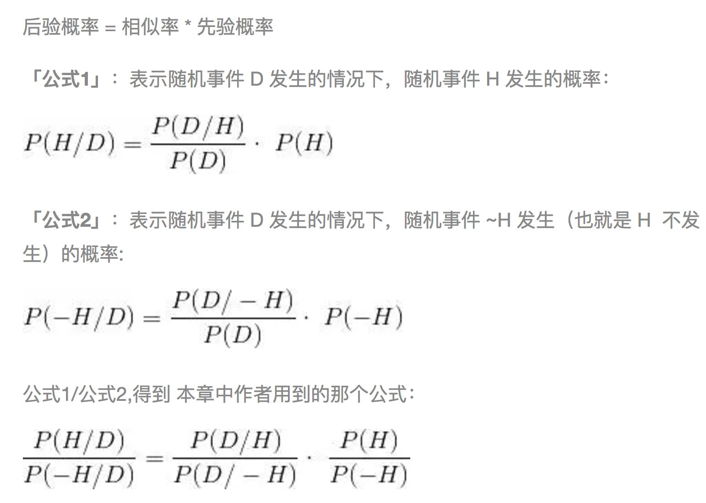

术语卡：贝叶斯定理 (Bayes’ theorem)

>定义：英国数学家托马斯·贝叶斯（Thomas Bayes）在1763年发表的一篇论文中，首先提出了这个定理。在概率统计中，基于条件与事件相关联的程度，描述在此条件下事件发生的可能性。能够告知我们如何用新证据修正已有的看法。在本书中使用的公式其实是原公式的变形。
>
>作者通过这个变形的贝叶斯公式，意在强调备择假设的概率 P(D/−H) 在计算中的必要性，也是试验中大多数人缺失的一种心智程序：
>
>**在焦点假设为假的情况下，人们没有意识到评估观测数据概率的必要性**。  
>那么问题又来了，作者为什么不用变形前的贝叶斯公式？会产生什么问题吗？  
上面的「公式1]，其实就是我们日常思维的数学形式：提出一个焦点假设 H，然后通过与假设相关的数据合集 D 对假设去进行验证，从而不断调整焦点假设成立的概率。
但是在接下来的两节「忽略备择假设」和「可证伪性」中，都在不断重复一个事实：

>**人们天然的思维倾向是寻找证实假设的证据而非证伪的证据**。

>体现在生活中，就是我们越是相信哪些观点，就会有意或无意找到更多支持此观点的证据。
由此想到「公式1」中两个要素的难点（可能存在的误区）：
所以，「公式2」通过数学推演的方式，让我们可以直观看到，人类思维模型中缺失的“关注备择假设 P(D/−H)”的那部分。
>
i. **先验概率的方向性和准确性**。先验概率只是猜测，允许主观因素进入到计算中。即使这种猜测为真的概率根本不存在（例如中医理论和上帝），你仍可以用（有局限性的）可得证据支持你可疑的信念。在这种情况下，贝叶斯定理可能和推理一样促进了伪科学和迷信。
>
ii. **数据集的完整性和可测量性**。一旦对事物形成某种观点，我们会本能的忽略与之相违背的证据，也就是所谓的偏见。即使在理性密集的学术界，仍然存在观点的争议，并且双方都提供了通过的科学方法获得的相应证据。

>例子：可能是为了便于初学者理解，看到贝叶斯方法最多的例子是诊断和识别类的应用。但是当今人工智能的发展却提供了一个贝叶斯方法更为宏大方向——机制演化。
  刚才提到「公式1」的2缺点,是指人的思维局限。那么尝试把贝叶斯推理的这两个要素无限放大，再来看一下。
从这个分析可以看出，把贝叶斯推理作为机制演化的方法是不过分的，至于和进化论的关系，可能要寻找更多的材料去探索。
>
i. **先验概率的方向性和准确性**。→ 在任意方向以随机概率出现。→ 类似「基因变异」  
ii. **数据集的完整性和可测量性**。→ 空间上存在不均衡，时间上从出现生物开始到现在，测量标准为所有可观测到的。→ 类似「适者生存」

>出处：Bayes’ theorem - Wikipedia